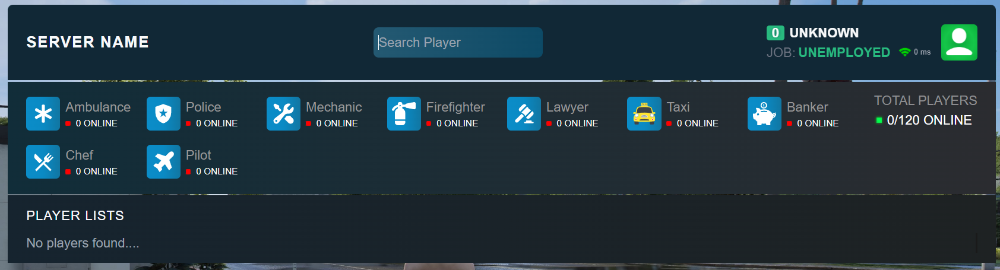

# Scoreboard System for Rebar Framework

Shows all login player scoreboard.

# Showcase

# Installation

From the main directory of your Rebar framework.

git clone https://github.com/battlezoneyt/rebar-scoreboard src/plugins/rebar-scoreboard
That's it.

If you wish to save the plugin in your own repository, go to the src/plugins/rebar-scoreboard folder and delete the .git folder.
